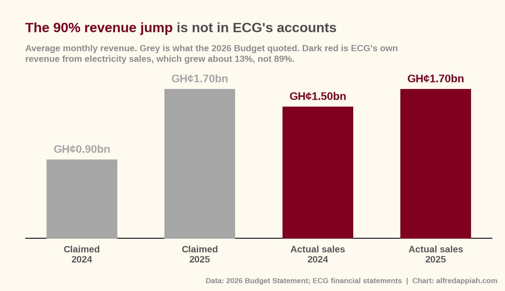
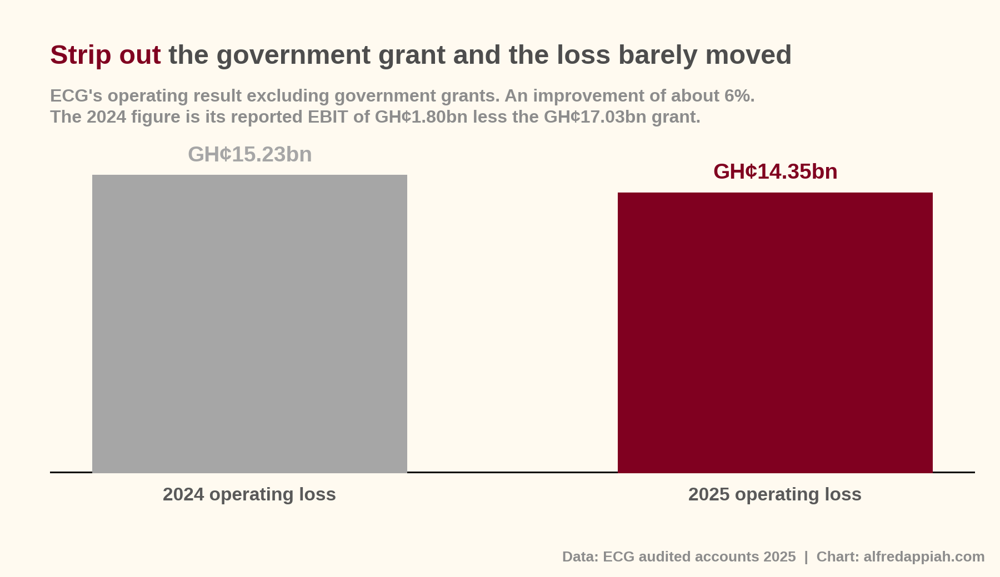
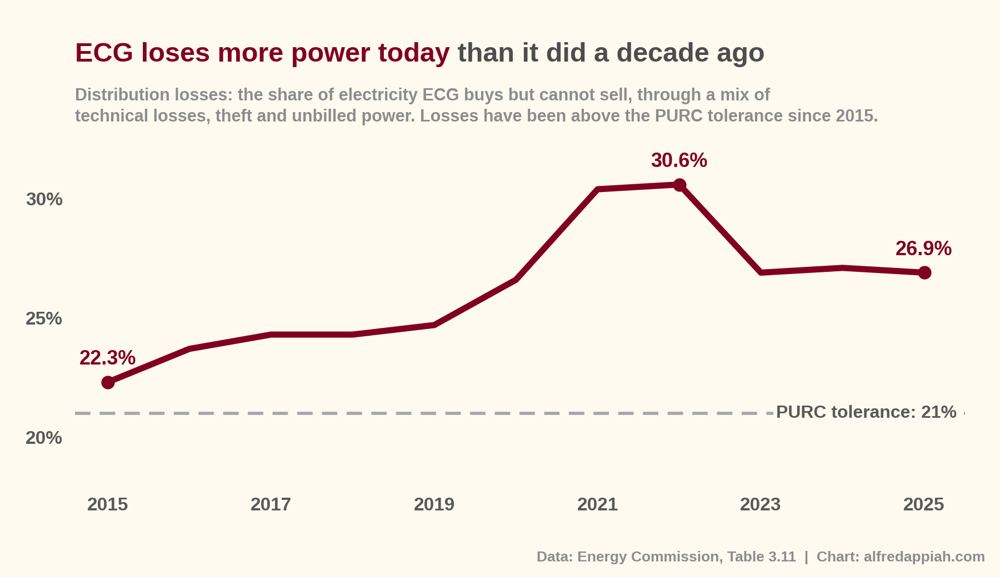
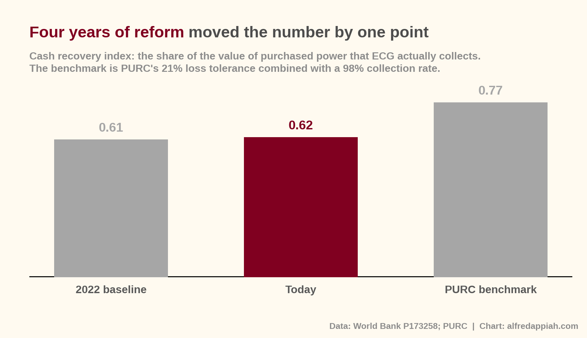
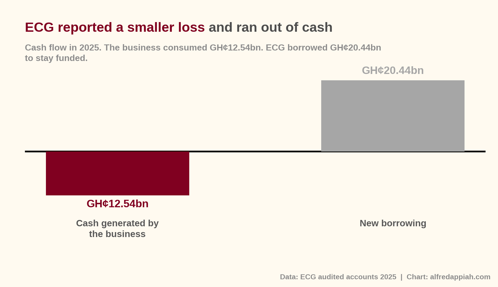

Sometimes a government's own public relations can be used against it. That is exactly what
is happening between ECG's workers' union and the government over private sector
participation. For context, the government wants private sector participation in ECG. The government has been
consistent that this is not a sale. ECG stays in state hands. What would change is that
private operators take over some part of running the distribution business under a
concession or public-private partnership. It's still very unclear how that would all work out. But we will wait for the transaction advisor appointed by government to finish their work. 

The government has painted a picture of a big turnaround at ECG. The Finance Minister [told Parliament](https://www.citinewsroom.com/2025/11/2026-budget-ecgs-revenue-has-improved-by-90-ato-forson/#:~:text=almost%2090%25%20from%20GHC900%20million%20to%20GHc1.7%20billion%20per%20month%2C%20thanks%20to%20better%20enforcement%20of%20Cash%20Waterfall%20Mechanism) in November last year that ECG's monthly revenue rose from GH¢900 million to GH¢1.7 billion, an
increase of almost 90 percent. The State Ownership Report shows ECG's loss shrinking from
GH¢8.2 billion in 2024 to GH¢2.5 billion in 2025.

The union has taken that picture and turned it around. If things have improved this much,
on the government's own account, why do we need to bring in a private operator?

It is a fair question. But before anyone answers it, there is a prior one worth asking.

**Has ECG actually turned around?**

## Start with revenue

ECG's audited accounts tell a different story from the budget statement.

In 2024, ECG's revenue from sales averaged about GH¢1.5 billion a month. In 2025 it averaged about
GH¢1.7 billion. That is growth of 13 percent. Real, but not 90 percent.

So where does the 90 percent come from?

The GH¢900 million is not what ECG earned in 2024. It is what ECG was declaring through the
Cash Waterfall Mechanism, the arrangement that splits electricity receipts between ECG, the
generators, the fuel suppliers and everyone else in the chain.

What improved was the declaration, not the earnings. Under the IMF programme, the government
commissioned PwC to audit ECG's revenue collection and declaration. Since the new
administration took office, the amount ECG declares to the mechanism has risen sharply, and
the Energy Minister has [pressed publicly for it](https://www.citinewsroom.com/2025/07/jinapor-ecgs-full-compliance-with-cash-waterfall-mechanism-boosting-power-stability/).

That is a real achievement and it matters. Money declared into the CWM is money that
reaches the generators and fuel suppliers, and it is the difference between a value chain
that can pay its bills and one that cannot. But declaring more of what you collect is not the
same as collecting more.

The government described better compliance with a payment mechanism as revenue growth. The
union is now running with the same framing.

## Now the bottom line

In 2024, ECG received a government grant of GH¢17 billion and counted it as revenue. In
2025 it received nothing like it. So the reported figures compare a year with a large
subsidy against a year without one.

Take the grant out of both years and you can see what the business itself did. ECG's
operating loss went from GH¢15.23 billion to GH¢14.35 billion.

That is an improvement of about 6 percent. It is movement in the right direction. It is not
the transformation either side is describing.

The wider figure in the State Ownership Report, the loss falling from GH¢8.2 billion to
GH¢2.5 billion, is largely a foreign exchange gain. ECG owes a great deal of money in
dollars, mostly to power producers it has not paid. When the cedi strengthened, the cedi
value of those unpaid bills fell, and accounting rules require that reduction to be booked
as a gain. No money changed hands. ECG still owes the same dollars. If the cedi weakens, the
same calculation runs in reverse.

## Two measures that are harder to spin

If you want to know whether a distribution utility is getting better at its job, there are
two numbers to watch.

**The first is distribution losses.** This is the share of electricity ECG buys but cannot
sell, through a mix of technical losses on the network and power that is stolen or never
billed.

Losses fell from 27.1 percent in 2024 to 26.9 percent in 2025. A movement of two tenths of
one percentage point.

Step back and it looks worse. In 2015 ECG lost 22.3 percent of the power it bought. Losses
climbed to a peak of 30.6 percent in 2022 and have since settled around 27 percent. Today's
figure is nearly five percentage points worse than a decade ago.

PURC allows a tolerance of 21 percent. ECG has not been under it in any of the last eleven
years.

There is also an awkward detail behind this year's small improvement. ECG bought 8 percent
more power in 2025, so the volume it actually lost went up, from 4,495 to 4,827 gigawatt
hours. It lost more power and bought enough extra to make the ratio look slightly better.

**The second is collection efficiency.** Of the electricity ECG does manage to sell, how
much does it actually get paid for?

According to figures Ghana reported to the World Bank under the [Energy Sector Recovery Programme](https://documents.worldbank.org/en/publication/documents-reports/documentdetail/099052924124034430), ECG's collection efficiency stands at
85 percent, against a programme baseline of 86 percent. It has gone backwards, and the World
Bank has formally marked the indicator off-track. PURC's target is 98 percent.

## Put the two together

Multiply them and you get what is called the cash recovery index. It answers a simple
question: of every hundred cedis of electricity ECG buys, how much does it eventually turn
into money in the bank?

For every GH¢100 of power ECG buys, it recovers about GH¢62 and loses about GH¢38. In 2022
it recovered about GH¢61.

Four years of reform programmes, a World Bank recovery programme, tariff adjustments and a
Cash Waterfall Mechanism have moved that number by one point. The benchmark implied by
PURC's own standards is about GH¢77.

In March 2025, at the National Economic Dialogue,
the Finance Minister described ECG as a financial black hole and said it collects only [62 percent of the electricity it distributes](https://www.myjoyonline.com/consumers-cannot-be-forced-to-pay-higher-tariffs-to-cover-ecgs-inefficiencies-ato-forson-calls-for-reform), leaving nearly 40 percent lost or unpaid for.

That is the same 62 percent. Eighteen months later, on the government's own chosen measure,
the number has not moved.

## The test that settles it

There is one more place to look, and it is the hardest to argue with. A company can report
whatever profit its accounting allows. Cash is cash.

In 2025, ECG's operations consumed GH¢12.54 billion. In 2024 they had generated GH¢6.51
billion. That is a swing of GH¢19 billion in the wrong direction, in the same year the
reported loss got smaller.

ECG covered the gap by borrowing GH¢20.44 billion.The money actually came from government. Instead of giving it a grant like in previous years, government loaned the money this time and expects ECG to pay back. 

Its equity, what would be left if it sold everything and paid everyone, fell from GH¢5.25
billion to GH¢438 million. On a balance sheet of GH¢82.75 billion, that is a company roughly
GH¢438 million away from being worth nothing.

A business that is genuinely turning around does not usually burn twelve and a half billion
cedis of cash and borrow twenty billion from the government to stay open.

## So where does this leave everyone?

Let me be fair to what did improve. Revenue grew 16 percent. The operating loss narrowed by
about 6 percent. Declarations into the Cash Waterfall Mechanism improved sharply, which
means generators and fuel suppliers are getting paid more reliably than before. None of that
is nothing.

But the hard data does not show a turnaround on the scale the government has described, or
on the scale the union is now relying on.

And that is the awkward position both sides are in.

The government made a case for its own performance, and in doing so it handed the union its
strongest argument against private participation. The union has picked it up and is using
numbers that do not really hold, to resist a policy the government now has to defend using
numbers it spent a year talking down.

Whether private sector participation is the right answer for ECG is a separate argument, and
a legitimate one to have. It should be had on the actual condition of the company.

Right now, neither side is describing that.

Good luck to all involved.

---

*Sources: 2026 Budget Statement; ECG audited financial statements for the year ended 31
December 2025; SIGA 2025 State Ownership Report; Energy Commission 2026 Energy Statistics,
Table 3.11; World Bank Ghana Energy Sector Recovery Program (P173258) implementation status
report; PURC.*
